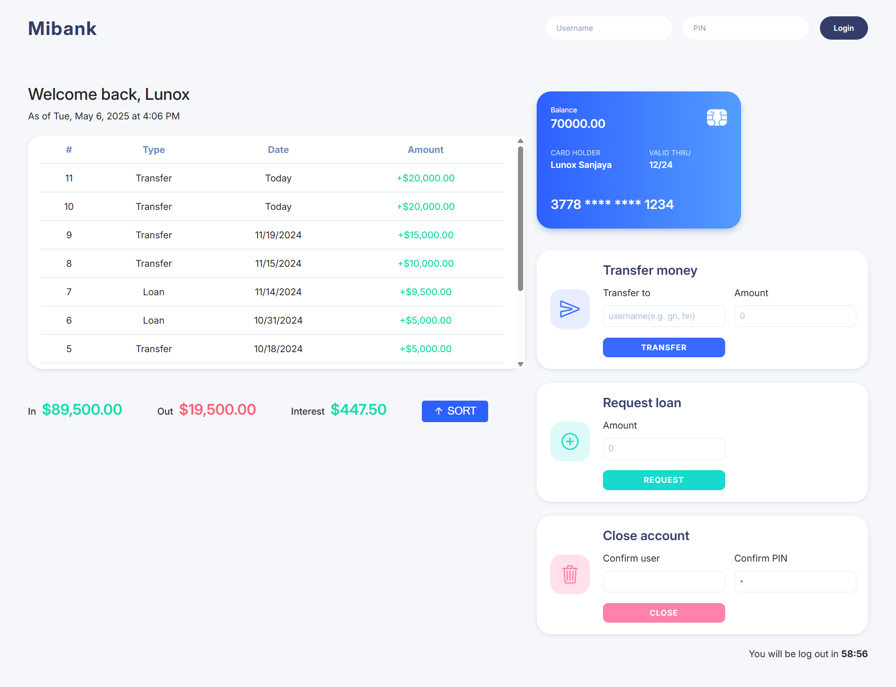

# Mibank
## Preview
Mibank is an abbreviation of minimalist bank built with HTML, CSS, and TypeScript. This project is designed to replicate the core features of a digital banking experience.
### Key Features
- **Auto Logout Timer**  
  Once logged in, users are granted a 15-minute session. For security purposes, the app will automatically log out the user after the session expires.
- **Money Transfer**  
    Users can simulate money transfer to other accounts.
- **Withdraw / Loan Money**
    This feature allows users to withdraw or borrow money from bank within predefined limits.
- **Close Account**
    Users have the option to delete their accounts.
- **Transaction History**
    All incoming and outgoing transactions are displayed in a structured transaction history.
### Technical Notes
- All user and transaction data are stored in arrays (no backend implementation yet).
- The project focuses on front-end logic.
## Flowchart

## Snapshot

